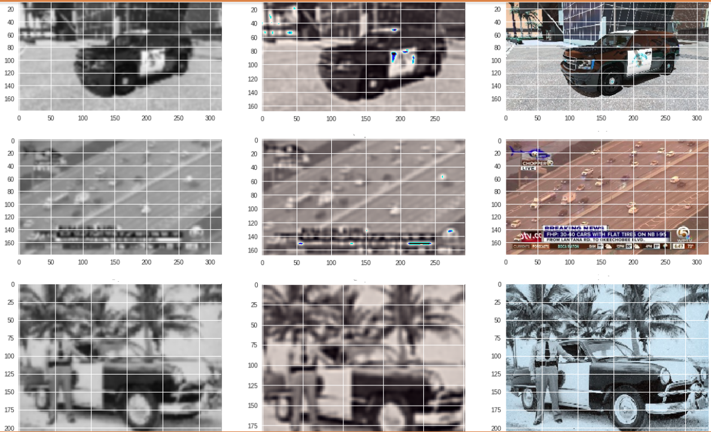
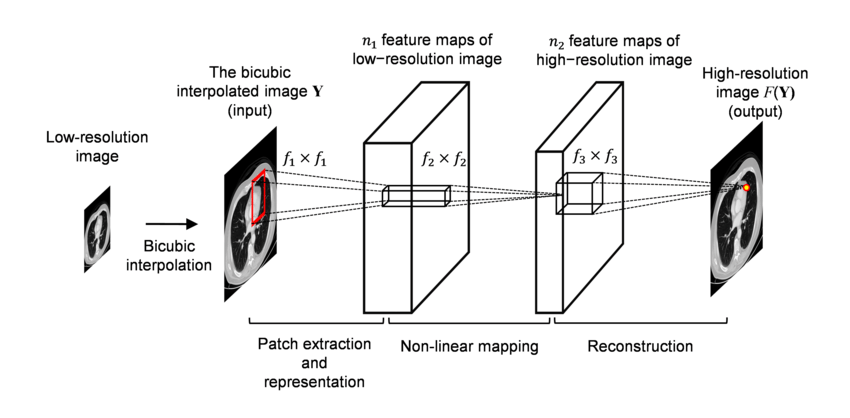

# Project: Can you unscramble a blurry image? 


### [Full Project Description](doc/project3_desc.md)

Term: Fall 2018

+ Team # Group 2
+ Team members
	+ team member 1 Yang Cai, yc3404
	+ team member 2 Yang Chen,yc3335
	+ team member 3 Yiming Shi,ys3050
	+ team member 4 Kehui Zhu,kz2293
	+ team member 5 Siyu Zhu,sz2716

+ Project summary: 
	+ In this project, we will carry out model evaluation and selection for predictive analytics on image data. Here we evaluate different modeling/analysis strategies and decide what is the best. And the decisions are supported by sound evidence in the form of model assessment, validation and comparison. Here, PSNR is the key factor we look into. 
	+ In addition, we also need to communicate our decision and supporting evidence clearly and convincingly in an accessible fashion. We were given a training set of 3000 images to realize a super resolution algorithm (half LR and half HR). 
	+ The baseline model is random feature extraction + GBM model. For improved model, we try different feature extraction methods, such as Canny, diagonal methods. We also try XGBOOST model. Our optimal model is using XGBOOST model on canny features, which leads to 25.23 PSNR, with a test running time of 784 seconds for 1500 images, whereas the baseline model is of 19.07427 PSNR and 2177.6 seconds. 

	+ Additionally, we use deep convolution nerual network to evulate the prediction analysis and obtain a PSNR of around 50 and a consuming time of around 45 minutes, but it did not satisfy the requirement of expanding image dimension. Thus, we choose not to use that model here.
	
**Contribution statement**:  All team members contributed equally in all stages of this project. All team members approve our work presented in this GitHub repository including this contributions statement. 


+ **Yang Cai**:  is responsible for constructing the features and developing the GBM model

+ **Yang Chen**: Built baseline model(GBM). Eveulate model with SR-CNN tensorflow. Updated the Summary section in the Readme file of the project. Prepare for this project from the group.

+ **Yiming Shi**:  is responsible for constructing the features and developing the GBM model

+ **Kehui Zhu**:  is responsible for constructing the features and developing the GBM model

+ **Siyu Zhu**: Main contributor to the baseline model (completed the feature.R and superResolution.R) and Optimal model(XGBoost model). Responsible for GBM and XGBoost models' parameters tuning. Assist with the SRCNN model's implementation. 

References used:
1.  https://rpubs.com/mharris/multiclass_xgboost : Perform XGBoost
2.  http://www.milanor.net/blog/cross-validation-for-predictive-analytics-using-r/ :  CV error
3.  https://cran.r-project.org/web/packages/gbm/gbm.pdf; https://github.com/TZstatsADS/Fall2017-project3-grp3:  Perform GBM
4.  https://github.com/tegg89/SRCNN-Tensorflow :  SRCNN


Following [suggestions](http://nicercode.github.io/blog/2013-04-05-projects/) by [RICH FITZJOHN](http://nicercode.github.io/about/#Team) (@richfitz). This folder is orgarnized as follows.

```
proj/
├── lib/
├── data/
├── doc/
├── figs/
└── output/
```

Please see each subfolder for a README file.
